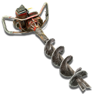
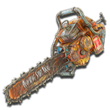

# 7 Days to Die assets

Collection of 7 Days to Die vanilla assets extracted from the `Data` and `7DaysToDie_Data` folders.

## Item Icons

From the game version `alpha11.6` you can find all the icons in the `ItemIcons` folder. For previous versions only a "bundle" has been extracted containing all the icon in a single file `Items3DPreviewAtlas.png`.

### Alpha20.5 preview

### Alpha10.4 preview

## XML files

The `Config` folder contains the original vanilla `.xml` files found in the installed game folder.

These can be modified to change the game settings, make balancements or to build mods.

For game versions prior to `alpha10.4` the only configuration file is `recipes.xml`.
